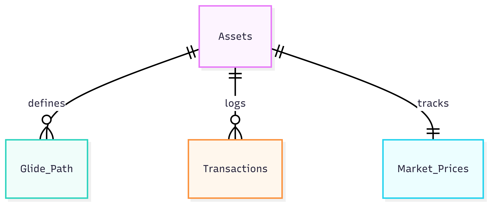

# Design Document

"Dynamic Glide Path Portfolio Manager"
By Jeffrey Chan

Video overview: https://www.youtube.com/watch?v=4M-WEYUmmhI

## Scope

This database is for my CS50 SQL final project. It is call the "Dynamic Glide Path Portfolio Manager" It help me to track my investments and see if I need to rebalance my assets based on my age. Included in the scope is:

* Assets, like stocks and ETFs, with their name and ticker
* Glide Path, which is my strategy for what percentage of each asset I should own at different ages
* Transactions, to record every time I buy or sell something
* Market Prices, to keep track of the latest price from the market

Things like tax, bank interest, or credit card debt are out of scope for this project.

## Functional Requirements

The database will support:

* Adding new assets and recording buy/sell transactions
* Calculating the total shares I own for each ticker
* Looking up my target allocation for my current age
* Updating the market price using my Python script
* Providing a simplified reporting layer via a SQL View to abstract complex joins for portfolio valuation.

It also have a "milestone" column, so in the future the system can change strategy when I reach a certain amount of money, not just my age.
The market_prices table acts as a temporary cache for the Python script. The script fetches live data via the yfinance API and uses INSERT OR REPLACE to keep the database current without duplicating rows.

## Representation

Entities are captured in SQLite tables with the following schema.
I used ON DELETE CASCADE on all foreign keys. This ensures that if an asset is removed from the system, all related history and strategy data are cleaned up automatically.

## Data Initialization

The project includes a seed.sql script to ensure a "ready-to-use" state upon deployment. This file populates the assets table with specific ETFs and defines a comprehensive 35-year investment Glide Path. By separating the strategy into a seed file, the system remains modular; the core logic is stored in the relational database rather than being hardcoded into the application logic, allowing for easy updates to the investment strategy.

## Usage

To reset the database to a clean slate and re-load the 35-year strategy before running the Python script, run this command in your terminal:

rm portfolio.db; sqlite3 portfolio.db < schema.sql; sqlite3 portfolio.db < seed.sql

### Entities

The database includes the following entities:

#### Assets
The assets table is the main list of things I invest in.

* `id`: INTEGER PRIMARY KEY. This serves as the unique identifier for relational mapping across the schema.
* `ticker`: The symbol used on Yahoo Finance (like VWRA.L). It must be UNIQUE.
* `asset_class`: I use a CHECK to make sure it only includes Equity, Bonds, Cash, or Crypto.
* `currency`: It support HKD, USD, and GBP.

#### Glide Path
This table tell the program what my "target" is.

* `asset_id`: This link to the assets table.
* `age`: The age for this specific target.
* `target_percent`: A decimal number (like 0.80 for 80%).
* `milestone`: A number to represent a net worth goal. I keep this optional for now.

#### Transactions
This table is for history. Every row is one trade.

* `type`: I use a CHECK to only allow 'BUY' or 'SELL'.
* `shares` and `price_per_share`: Used to calculate the cost.
* `date`: It defaults to the current day.

#### Market Prices
This is a simple table to store the "live" price.

* `asset_id`: It is UNIQUE because one asset only has one current price.
* `current_price`: The latest price from the API.

#### Views
`portfolio_summary`

To simplify the user experience, I created a View that aggregates data across three tables. It provides a real-time snapshot of the portfolio by calculating the total shares owned, their current market value (in HKD), and the last time the price was refreshed. This abstracts the complex JOIN and SUM logic away from the end user.

* Purpose: Aggregates data from assets, transactions, and market_prices.
* Calculations: Computes `total_shares` and `market_value_hkd` (Shares × Current Price).
* Benefit: This abstracts the complex JOIN and SUM logic, providing a "single source of truth" snapshot for the Python logic and the end user.

### Relationships
The below entity relationship diagram describes the relationships among the entities in the database.

As detailed by the diagram:

* One Asset can have many Transactions. This is a one-to-many relationship because I might buy the same stock many times.
* One Asset has many rows in the Glide Path table. This is a one-to-many relationship, allowing the database to store a historical and future evolution of the investment strategy for a single ticker.
* One Asset has only one Market Price. This is a one-to-one relationship to make sure the math stay simple.

## Optimizations
I added an index on asset_id in the transactions table. This is because my Python code needs to sum up all the shares for an asset very often, so the index make it faster. I also added an index on age in the glide_path table to quickly find my strategy when I log in.

## Limitations
The current system only calculate "total bought" easily. If I sell a lot of shares, the SQL query for "Current Value" needs more complex math. Also, the user must update the prices manually or by running the Python script, it doesn't update by itself.

* Cost Basis: Currently, the system aggregates total shares but does not calculate realized gains/losses using FIFO (First-In-First-Out) logic.
* Currency Sync: While it supports multiple currencies, the database assumes the Python script handles all conversions to a base currency (HKD) before storage.

Future iterations will implement a 'Position' logic that calculates the Weighted Average Cost (WAC) to provide more accurate performance metrics beyond simple total holdings.
